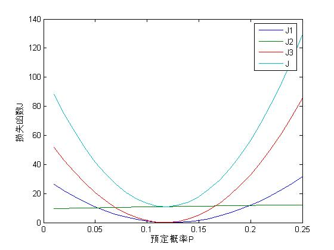

## 1 问题重述与假设
### 1.1 问题重述
出租车载客收益与载客的行驶里程有关，行驶里程越长，收益越高。花费数小时的时间排队的出租车如果只接到了短程的旅客（以下简称短程车），相较于其他出租车来说，收益明显低于平均值，为了平衡出租车之间的收益差距，机场应当鼓励一部分短程车在完成短程载客后回到机场，给予他们一定的“优先权”，即允许跳过排队过程，优先接待候车区的旅客。

### 1.2 问题目标
设计算法，通过给予返回机场的短程车“优先权”的方法，平衡短程车与正常排队出租车的收益，达到效果
1. 使双方的收益尽量一致。
2. 短途车的“优先权”会使得队列整体行进速度变慢，因此需要控制拥有“优先权”的短程车的数量

### 1.3 假设
为了解决短程车“优先级”的问题，现根据实际情况做出如下假设：
- 在载客距离较长的情况下，可以忽略起步价的影响。
- 出租车的行驶速度一定且个体之间没有差异，即载客距离，行驶时间，收益，三者成正比。
- 从机场搭乘出租车的乘客的乘车路程呈现以机场到市中心的距离为均值的正态分布。
- 驾驶员与乘客均遵守下文规定，不存在违规行为。
- 短程车载客时的收益速率等于市区载客的收益速率（以下称正常收益速率）
> 收益速率：单位时间内的收益

#### 1.3.1 假设合理性解释
以合肥新桥国际机场为例（其他城市的机场作上述假设也是合理的）
- 合肥市小型出租车的起步价为8元/2.5公里，公里租价为1.3元，而从机场出发的出租车，行程普遍大于等于10公里（即使是短程车），因此我们可以近似认为起步价的影响可以忽略，即在行驶过程中，载客距离与收益成正比。
- 目前城市的各个主干道都有限速规范，不同出租车个体之间的速度差距不会过大。第二，出于实践考虑，我们希望用时间代替路程，这样仅仅通过计时，就可以较为容易地判断一辆出租车是不是短程车，而不用进行复杂的定位处理。第三，在建立模型时，用时间来衡量收益可以有效地简化模型。
- 以合肥市人口分布图为例
    
    可以看到，合肥市的人口分布以市中心的庐阳区，瑶海区，包河区等地区为核心，逐渐向四周扩散，人口密度逐渐减小，基本符合正态分布。
- 为了简化模型，不考虑违规情况
- 短程载客与市区内载客的路程长短相当，可以看做收益相当

## 2 模型建立
### 2.1 符号表
| 符号 | 含义 |
| --- | --- |
| $t_p$ | 出租车的平均排队时间 |
| $t_s$ | 短程车的平均载客时间（也等于从目的地回到机场的时间） |
| $t_{smin}$ | 出租车被界定为短程车的最短载客时间 |
| $t_{smax}$ | 出租车被界定为短程车的最长载客时间 |
| $p$ | 短程车占所有出租车的比重（概率） |
| $p_{pre}$ | 预计的短程车占比 |
| $f(t)$ | 出租车载客时间分布的概率函数 |
| $t_\mu$ | 长程车平均载客时间 |
| $\lambda_i (i = 1,2)$ | 损失函数的约束参数 |

### 2.2 建立收益均衡方程
从一辆短程车的视角出发，从它开始在机场排队开始，到回到机场为止，整个流程是：
1. 排队：平均用时$t_p$
2. 载短程客：平均用时$t_s$
3. 从下客点回到机场：平均用时$t_s$

而一辆非短程车（长程车）的流程是：
1. 排队：平均用时$t_p$
2. 载长程客（一般是去市区）：平均用时$t_\mu$
3. 在市区继续载客，恢复正常收益速率

于是，短程车总用时$t_p + 2t_s$，其中$t_s$时间处在正常收益速率，另外的$t_p + t_s$处于无收益状态。短程车回到机场后，如果机场给予短程车优先权，那么它可以直接载客回到市区，恢复正常收益速率。

相比之下，长程车排队的$t_p$时间内无收益，载客到达市区之后恢复正常收益速率。

于是，短程车的无收益时间大于长程车的无收益时间，为了平衡二者的差距，给予短程车“优先权”，允许短程车无需排队，直接在上车点载客。

短程车的“优先载客”在长程车看来是一种“插队行为”，会导致整个队列的行进速度变慢，等待时间边长。

若短程车占所有出租车的比重为$p$，则长程车的排队时间变为了$$t_q(1 + p) \tag{2.1}$$

短程车的空载时间一共为$$t_s + t_q \tag{2.2}$$

为了使长短程车收益均衡，则两式相等$$t_q(1 + p) = t_s + t_q$$

即$$t_s = p*t_q \tag{2.3}$$

### 2.3 建立计算模型
方程(1.3)中，$t_q$为已知参量（由统计数据得出），$t_s$和$p$都依赖于对短程车的界定，即需要给出$t_{smin}$和$t_{smax}$

$$p = \int_{t_{smin}}^{t_{smax}}f(t)dt \tag{3.1}$$
$$t_s = p*t_q = \int_{t_{smin}}^{t_{smax}}f(t)dt*t_q \tag{3.2}$$

在实际操作上，我们真正关注的是$t_{smin}$和$t_{smax}$，我们利用这两个量就可以界定短程车的范围，从而实施“优先权”策略。

为了选取合适的$t_{smin}$和$t_{smax}$，需要一个量化的方法来判断所选择的$t_{smin}$和$t_{smax}$好坏。为此，我们设立了一个损失函数$J$，对每一对{$t_{smin},t_{smax}$}，有

$$J_1 = (\frac{t_{smin}+t_{smax}}{2} - t_s)^2 \tag{3.3}$$
$$J_2 = \lambda_1 t_{smax}^2 \tag{3.4}$$
$$J_3 = \lambda_2 (p - p_{pre})^2 \tag{3.5}$$
$$J = \sum_{i=1}^{3}J_i \tag{3.6}$$

（3.3）式限定了能够使长短程车收益平衡的$t_s$需要在短程车界定区域内部，如果不作限制，界定出来的短程车可能会获得过多的收益或者过少的收益。

（3.4）式限制了$t_{smax}$不能过大，否则界定出来的短程车实际上载客距离和长程车一致，然后又回到了机场，不符合常理。

（3.5）式首先给出了一个预计的短程车占比$p_{pre}$，我们希望返回机场的短程车不要过多，否则短程车的“插队”行为会使队列的行进速度变得十分缓慢，因此预先设定一个短程车占比值，并且希望界定出来的短程车占比不要超过$p_{pre}$太多。 

### 2.4 模型求解
2.3节给出了需要进行优化的损失函数$J$，本节中采用**梯度下降法**对该损失函数进行优化。

#### 2.4.1 梯度下降法
梯度下降法是机器学习领域的常用的寻找最优参数的方法，核心思想为：从一个初始点开始，每次朝着损失函数下降最快的的方向移动一次待优化的参数（在本文中即为$t_{smin}$和$t_{smax}$），反复此过程，最终待优化参数会停在损失函数的极小值点上。

伪代码为：
`for i = 1:iter_num`
$$ t_{smin} = t_{smin} - \alpha*\frac{\partial{J}}{\partial{t_{smin}}}$$
$$ t_{smax} = t_{smax} - \alpha*\frac{\partial{J}}{\partial{t_{smax}}}$$
`end`

其中$\alpha$为学习率，即梯度下降的速率

#### 2.4.2 参数赋值
为了求解该模型，需要对一些参数进行赋值，结合实际情况，对一些参数赋值如下表
| 参数 | 值 | 单位 |
| --- | --- | --- |
| $t_q$ | 180 | min |
| $p_{pre}$ | 0.01:0.01:0.25 | 无 |
| $f(t)$ | 服从均值为45，标准差为10的正态分布 | 无 |

> 0.01:0.01:0.25表示从0.01到0.25，每隔0.01取一个值

#### 2.4.3 求解结果
运行梯度下降程序（附件：梯度下降代码），迭代次数为200次，得到的学习曲线为

$$p_{pre}=0.25$$

$$p_{pre}=0.12$$
梯度下降在100次迭代附近就已经达到了最大效率，之后的迭代下损失函数几乎不变。

保持200次的迭代次数不变，调整$p_{pre}$从0.01到0.25，最终得到的损失函数$J$与$p_{pre}$关系如下图

$J$的三个组成部分中，$J1$和$J3$都随$p_{pre}$的增加先减少后增加，而$J2$近乎不变，$J$的变化规律和$J1,J3$相似。

$J$的终值在$p_{pre}=0.12$时达到最小值

$p_{pre}=0.12$时，
$$
J1 = 0.012, \\
J2 = 10.993, \\
J3 = 0.043, \\
J = 11.048, \\
t_{smin} = 9.512, \\
t_{smax} = 33.155,\\
t_s = 21.226,\\
p = 0.117 \\
$$

> 所有结果保留小数点后三位

#### 2.4.4 结论
由求解结果得出，在$p_{pre}=0.12$时，短程车优先的策略所得到的效果最好，并且可以规定载客时间在10-33分钟之间的出租车为短程车，机场给予其优先权，让其无需排队，直接再次载客。

按照这个策略，短程车占所有出租车的比重约为0.117，上海浦东国际机场的统计为0.15（**引用**），减少了约0.3，队列可以行进地更快。

### 2.5 模型评价与改进 
#### 2.5.1 模型评价
- 设定了一些简化模型的假设，虽然简化了模型建设与求解，但是一定程度上也减少了模型与实际的切合性。
- 缺少足够的真实数据，所得结果与实际情况有所偏差，但是该模型可以直接带入真实数据求解。
- 人为设定$J1,J2,J3$，可能有更多的考虑因素没有涉及。
- 虽然只有0.12占比的短途车，但是在实际情况中，由于出租车基数庞大，会一直有短途车返回机场，并且获得“优先权”而持续占据上车点，导致正常排队的出租车很难上客。

#### 2.5.2 模型的改进
针对短途车始终具有“优先权”，导致正常排队的出租车无法上车的情况，本文采用“短途-长途轮转”的方式预防“**饥饿问题**”。
> 饥饿问题：拥有优先权的少量个体会堵塞大多数个体

“短途-长途轮转”操作方式：给回到机场的短途车单独设置一个队列，在上车点处，管理员调车时，一次调短途车（如果有），一次调正常排队的车，两条队列轮流调度，可以保证正常队列不会被一直堵塞。

